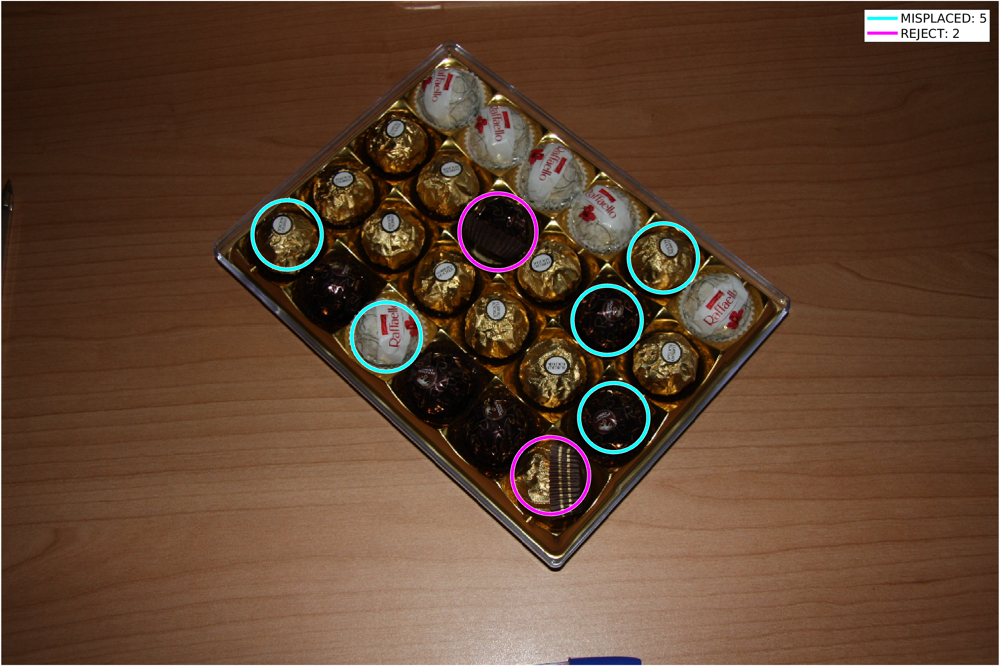
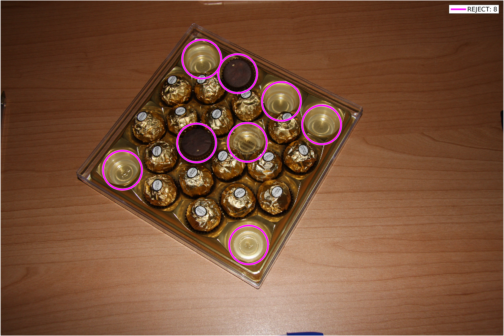
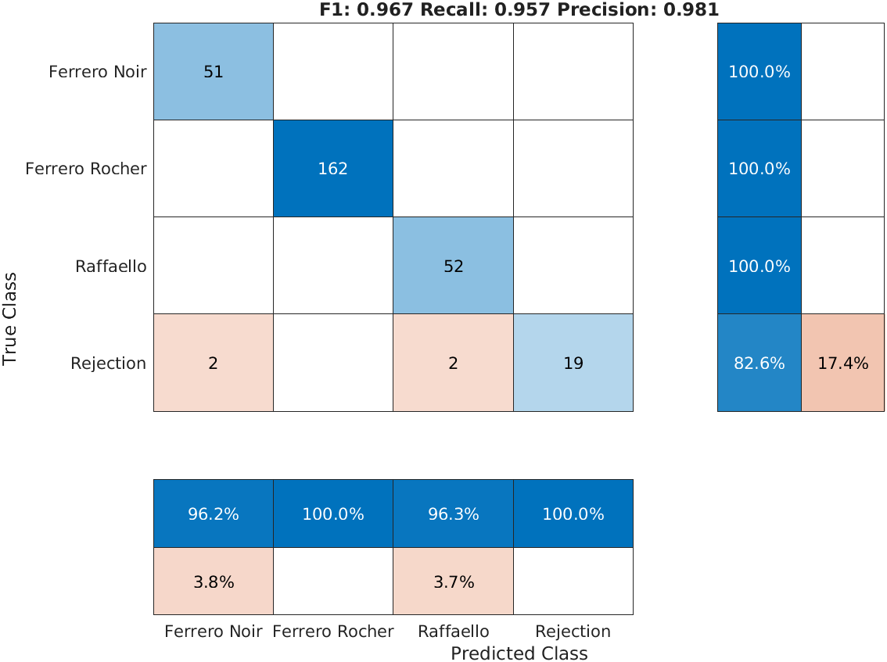
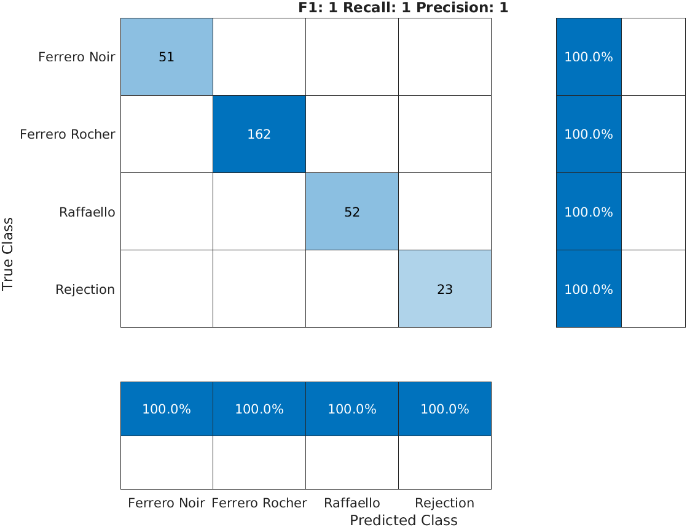
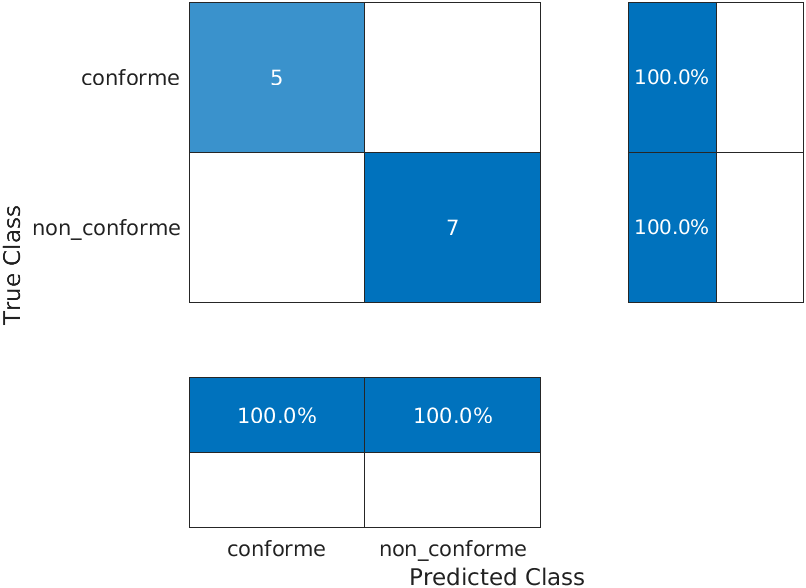

## Descrizione Nuovi Dati

Il dataset delle scatole di cioccolatini consiste di 64 immagini, che sono suddivise in conformi e non conformi. Di seguito è riportata la distribuzione:

| Classe       	| Training 	| Test 	| Totale 	|
|--------------	|:---------:|:-----:|:-------:|
| conforme     	| 33       	| 5    	| 38     	|
| non_conforme 	| 19       	| 7    	| 26     	|
| Totale       	| 52       	| 12   	| 64     	|

Un altro dataset è stato creato con i singoli cioccolatini estratti dalle immagini, suddivisi per tipo (Ferrero Rocher, Ferrero Noir, Raffaello, Rejection):

| Classe       	  | Training 	| Test 	| Totale 	|
|--------------	  |:---------:|:-----:|:-------:|
| Ferrero Noir 	  | 155      	| 51   	| 206    	|
| Ferrero Rocher 	| 857      	| 162  	| 1019   	|
| Raffaello     	| 159      	| 52   	| 211    	|
| Rejection     	| 105      	| 23   	| 128    	|
| Totale        	| 1276     	| 288  	| 1564   	|

## Miglioramenti

Il codice e la pipeline sono stati ristrutturati per ottenere maggiore modularità ed efficienza. Inoltre, la classificazione dei cioccolatini e la gestione degli errori sono stati migliorati.

### Classificazione dei Cioccolatini

La classificazione dei cioccolatini è stata perfezionata introducendo nuove feature e migliorando il modello di classificazione. 

Le feature che sono state considerate sono:

- Handcrafted Features: Istogramma locale HSV + Local Binary Pattern (LBP)
- Deep Features: ResNet18

In aggiunta, è stata utilizzata la tecnica di Principal Component Analysis (PCA) per ridurre la dimensionalità delle feature. 

Inoltre, l'addestramento e la valutazione del modello sono stati migliorati tramite l'ottimizzazione degli iperparametri usando un metodo di cross-validation con 10-fold.

  
### Gestione degli Errori

Gli eventuali errori sono stati identificati e categorizzati per poterli visualizzare in maniera più dettagliata.

Gli errori sono stati suddivisi in tre categorie: posizionamento errato (per le scatole rettangolari), bollini mancanti (per i Ferrero Rocher), e tutti gli altri sono stati raggruppati nella categoria di rigetto.

| Scatola Rettagonale |  Scatola Quadrata  |
|:-------------------:|:--------------------:|
|  |  |

## Risultati Test

### Classificazione dei Cioccolatini

| Local HSV Histogram + LBP | ResNet18   |
|-------------------|--------------------|
|  |  |

### Classificazione di Conformità 

## Limitazioni e Sviluppi Futuri

Nonostante i miglioramenti che sono stati effettuati, ci sono ancora delle limitazioni che potrebbero essere risolte in futuro.

- La quantità di dati è limitata (solo 64 immagini). Inoltre, la distribuzione delle classi dei cioccolatini è sbilanciata. Nello specifico la classe rigetto, come bollini mancanti e oggetti estranei, è piuttosto poco rappresentata.

- Il sistema attualmente non è in grado di gestire nuovi tipi di anomalie o di classificarle con precisione, a causa della scarsità di dati disponibili. In futuro, sarebbe necessario raccogliere più dati o adottare un approccio non supervisionato basato su tecniche di novelty detection.

- La distorsione prospettica potrebbe portare alcuni bollini ad essere tagliati durante il rilevamento dei cerchi con la trasformata di Hough, quindi effettuare il warping della scatola potrebbe evitare potenziali errori.

- La segmentazione della scatola può essere migliorata adottando la trasformata Watershed per separare eventuali oggetti attaccati alla scatola.
